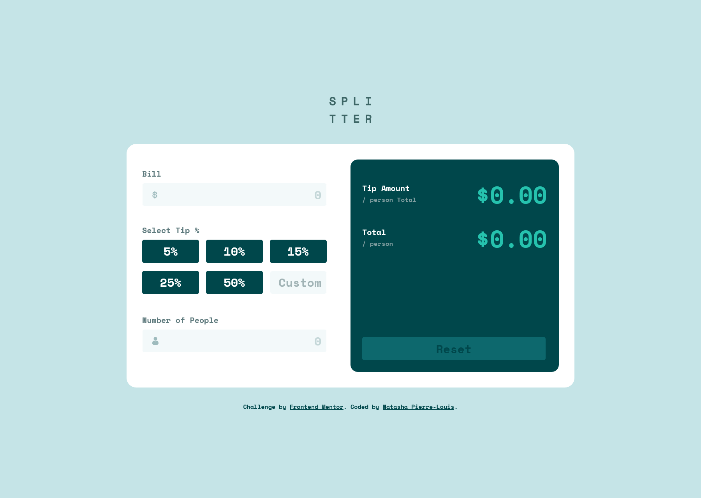

# Frontend Mentor - Tip calculator app

This is a solution to the [Tip Calculator App challenge on Frontend Mentor](https://www.frontendmentor.io/challenges/tip-calculator-app-ugJNGbJUX). Frontend Mentor challenges help you improve your coding skills by building realistic projects. 

## Table of contents

- [Overview](#overview)
  - [Screenshot](#screenshot)
  - [Links](#links)
- [My process](#my-process)
  - [Built with](#built-with)
  - [What I learned](#what-i-learned)
  - [Useful resources](#useful-resources)
- [Author](#author)

## Overview

### Screenshot of My Solution

### Links

- Solution URL: [https://github.com/natashapl/fem-tip-calculator-app-main](https://github.com/natashapl/fem-tip-calculator-app-main)
- Live Site URL: [https://natashapl.github.io/fem-tip-calculator-app-main/](https://natashapl.github.io/fem-tip-calculator-app-main/)

## My process

### Built with

- Semantic HTML5 markup
- CSS custom properties
- Flexbox

### What I learned

For this project, I decided to challenge myself to create the javaScript for this app without looking at anyone else's solution. After years of working with javaScript, I still haven't quite mastered it yet, so projects like these area great practice. I did use online resources such as W3 Schools and MDN Web Docs and the like, as needed.

### Useful resources

- [MDN Web Docs](https://developer.mozilla.org/) - A great resource for all things related to CSS, HTML and Javascript.
- [W3 Schools](https://www.w3schools.com/) - Another great resource for all things related to CSS, HTML and Javascript
- [20+ Amazing Pure CSS Accordions [Examples 2022]](https://alvarotrigo.com/blog/css-accordion/) - More examples of pure CSS accordions for inspiration.
- [Name that Color](https://chir.ag/projects/name-that-color/) - This is still my favorite utility tool for generating unique color names from hex codes.

## Author

- Website - [Natasha Pierre-Louis](https://www.natashasfolio.com)
- Frontend Mentor - [@natashapl](https://www.frontendmentor.io/profile/natashapl)
- LinkedIn - [natashapl](https://www.linkedin.com/in/natashapl/)